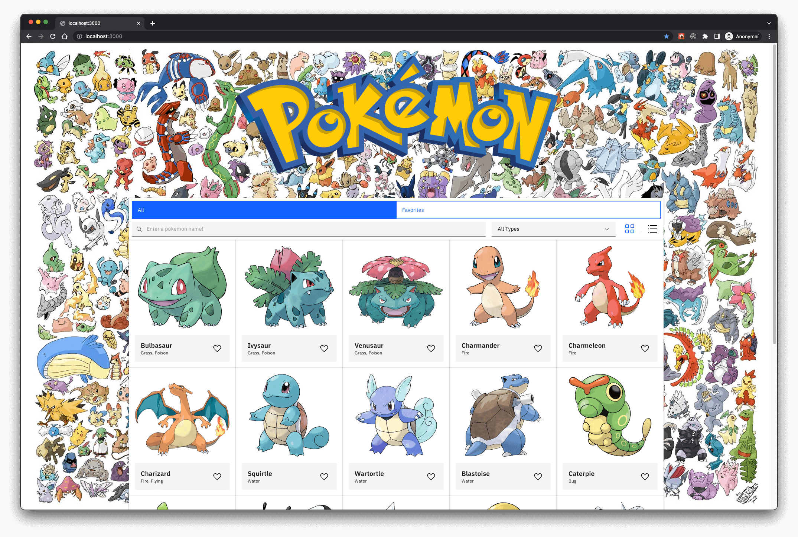
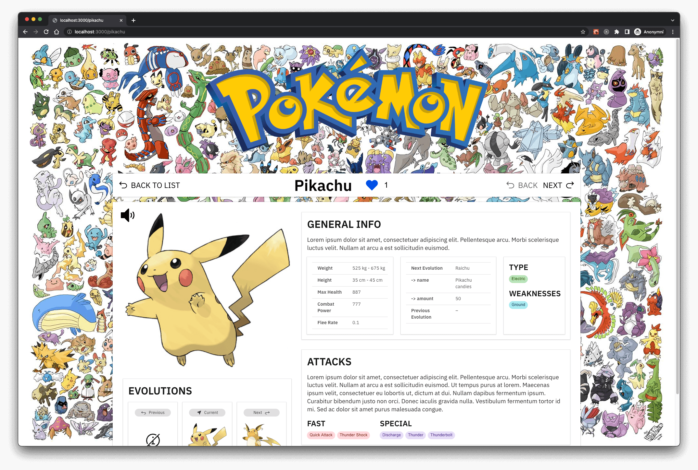

# 🤌🏻 PokéBrowser

PokéBrowser is a web application that allows you to easily search and filter Pokémons.
You can add them to your favorites, and view their details. 

Application is fully tested (E2E tests - Cypress, Integration/Unit tests - Vitest). 





## Features

- Search for Pokémon by text through use of a search bar.
- Filter Pokémon by type using a dropdown.
- Add and remove a Pokémon to and from your favorites by clicking the heart icon.
- Use tabs to switch between All Pokémon and Favorite Pokémon views.
- Change the view from either a grid or list.
- View Pokémon details.
- Play the sound of each Pokémon.

## What's inside?

### Apps and Packages

- `apps/web`: Next.js app (Apollo GraphQL, Styled-Components, Carbon Design)
- `apps/api`: Fastify (Yoga/Nexus GraphQL, Knex, Objection.js)
- `packages/eslint-config-custom`: `eslint` configurations (includes `eslint-config-next` and `eslint-config-prettier`)
- `packages/tsconfig`: `tsconfig.json`s used throughout the monorepo

## Preparation

- NodeJS with version 18.13+ (ideally use `nvm`).
- MySQL 5+ server.
- Create and fill `apps/api/.env.local` and `apps/api/.env.test` (ensure that specified databases exist!)

Run following commands:

```bash
$ cd apps/api

$ npm run database:migrate
$ npm run database:import
```

### Develop

To develop all apps and packages, run the following command:

```bash
$ npm run dev
```

### Build

To build all apps and packages, run the following command:

```bash
$ npm run build
```

### Test

To run unit and integration test, simply run:

```bash
$ npm run test
```

to run E2E test, run:

```bash
$ npm run test:e2e
```
